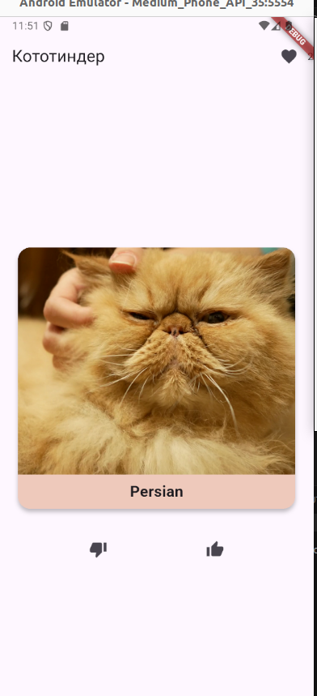
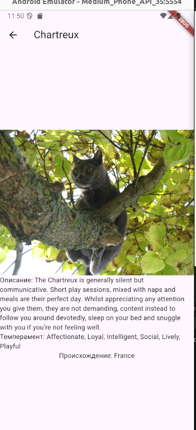

# Кототиндер 🐱

Приложение для свайпа случайных котиков, вдохновленное Tinder, где пользователи могут лайкать и дизлайкать милых котиков.

## 🔥 Фичи

- **Свайп котиков**: Свайп влево — дизлайк, вправо — лайк.
- **Просмотр подробной информации о котиках**: Кликнув на котика, можно увидеть подробности о его породе и другие данные.
- **Экран с лайкнутыми котами**: Все котики, которых вы лайкнули, будут отображаться в отдельном экране.
- **Удаление котиков из лайкнутых**: Легко удалить котиков из списка лайкнутых.
- **Фильтрация по породе**: Возможность фильтровать котиков по их породе.
- **Диалог ошибки при проблемах с сетью**: При проблемах с интернет-соединением отображается уведомление.
- **Загрузка с индикатором**: Индикатор загрузки данных при первом запуске и во время обновления котиков.
- **Реализация с использованием BLoC**: Приложение использует архитектуру BLoC для управления состоянием.
- **Поддержка оффлайн-режима**: Котики кэшируются для возможности использования приложения при отсутствии сети.

## 📸 Скриншоты

## 📦 APK
[Скачать APK](https://github.com/msmirnovv/flutter_mipt_cototinder/blob/main/app-release.apk)